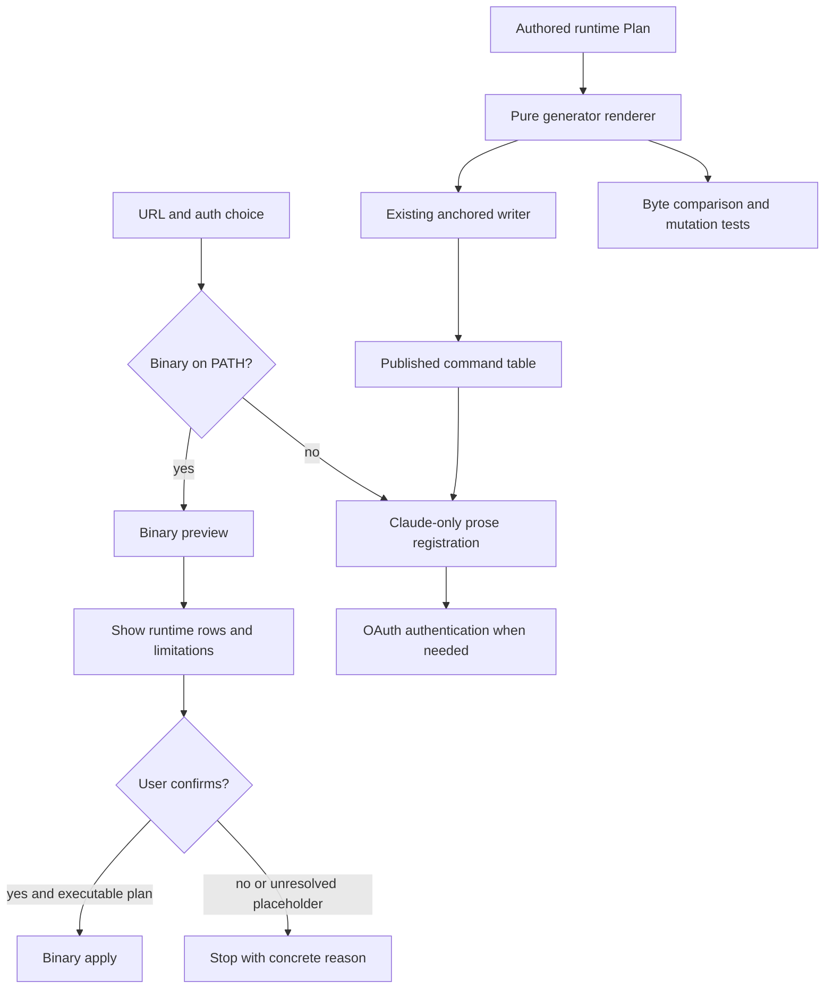

# Phase 05: Slash Command Delegation - Research

**Researched:** 2026-09-12
**Domain:** Go-driven Markdown generation, CLI handoff, derived conformance
**Confidence:** HIGH for source findings; MEDIUM for external documentation
**Planning readiness:** Resolve the explicit decision conflicts below before implementation.

<user_constraints>
## User Constraints (from CONTEXT.md)

The following decision and discretion text is copied verbatim from the phase context.
[VERIFIED: .planning/phases/05-slash-command-delegation/05-CONTEXT.md]

<!-- DATA_6d413bea_START -->
## Implementation Decisions

### Delegation handoff

- **D-01:** `/engram-setup` detects the binary by plain PATH presence — the prose instructs the
  agent to run `command -v engram`. Present → delegate; absent → prose path. Exactly one condition,
  matching how `engram setup` itself detects runtimes (Phase 2 `Environment.LookPath`). Rejected:
  a version floor via `engram version --output json` — it adds a second failure mode ("present but
  too old") the prose would then have to explain.
- **D-02:** The handoff is `engram setup --url <url> --auth <mode>` run **preview first** (no
  `--apply`); the slash command shows the resulting row table; `--apply` runs only after the user
  confirms. This mirrors the CLI's own preview-by-default contract (REQ-setup-previews-by-default)
  and is the concrete lesson of the Phase 4 live-config incident (`ryr82bf2s2`). Rejected:
  straight to `--apply`.
- **D-03:** Delegation covers every runtime the binary detects — the slash command passes no
  `--runtime`. The binary's own detection is the point of delegating; pinning `--runtime
  claude-code` would make delegation strictly weaker than running `engram setup` directly.
- **D-04:** The prose's four auth modes map 1:1 onto `--auth oauth|oauth-client|bearer|none`.
  Bearer uses `--token-file`, never the token on argv (Phase 3 D-05; REQ-register-auth-modes).
  Rejected: letting the binary prompt for auth itself.

### Prose fallback scope

- **D-05:** When the binary is absent, the fallback is exactly today's prose path — Claude Code
  registration via `claude mcp add`, four auth modes, `/mcp` to authenticate. Behavior unchanged
  (SC2). Rejected: extending it to hand-walk skills install.
- **D-06:** The fallback does not mention skills. The plugin already ships the five skills, so a
  plugin-only install has them; skills *distribution* to non-plugin runtimes is the binary's job,
  which the prose cannot reach.
- **D-07:** The fallback carries one non-blocking line pointing at the binary — `brew install
  seanb4t/tap/engram` registers every runtime and installs skills; this path covers Claude Code
  only — then continues. Rejected: keeping the prose path silent about the binary.
- **D-08:** The prose covers Claude Code only, as today. It is a Claude plugin command running
  inside Claude Code; codex/opencode registration without the binary is out of scope.

### Generated region and source of truth

- **D-09:** The source of truth is `internal/setup/claudecode.go`'s authored `Args` per auth mode
  — the exact argv the binary executes. `internal/setupgen` imports `internal/setup` in-process,
  calls `Plan()` per mode with placeholder values, and renders. No second copy of the argv exists
  anywhere. Rejected: a shared YAML/JSON data file both the CLI and generator read — that is a
  second artifact to keep in sync, the thing this phase exists to eliminate.
- **D-10:** Generated: the **command table** (mode → `claude mcp add …` argv) and the
  **delegation invocation** (`engram setup --url … --auth …`). Hand-written: the surrounding
  steps, the notes, the brew pointer. Rejected: generating the whole `## Steps` section.
- **D-11:** The region is delimited by `internal/surfaces/anchor.go`'s existing
  `<!-- engram:rule:start ID -->` / `<!-- engram:rule:end ID -->` pair, written via `WriteRegion`
  — the same mechanism `skill/engram/skills/*/SKILL.md` and docs-site already carry. New anchor
  ID; no new marker syntax. Rejected: whole-file generation (the `.md` as a build artifact).
- **D-12:** Package `internal/setupgen` (already named in Phase 4's CONTEXT), invoked from the
  existing `task surfaces:gen` — one regeneration path, never a second divergent one (the CI
  comment at `ci.yaml:290` states this invariant). Rejected: a separate `task setup:gen`.

### The equivalence gate

- **D-13:** The gate is regenerate-then-`git diff --exit-code` on
  `skill/engram/commands/engram-setup.md` — byte identity after regeneration. This is the CI drift
  gate that already exists (`ci.yaml:298` diffs `skill/`), extended by one generator. Rejected: a
  golden-file test — it proves the same thing with a second artifact.
- **D-14:** The gate runs in CI (already) **and** in `task lint`, so `task` fails before push.
  Fails closed. Rejected: CI only.
- **D-15:** Non-vacuity is proven by a mutation test: substitute a fake `Plan()` that flips one
  argv token, assert the rendered region **changes**. This proves the generator reads the source
  rather than a hardcoded literal — the keyword-presence-gate-that-proves-nothing shape this repo
  has hit before (`6ey7knaz8v`) and REQ-delegation-equivalence-derived names explicitly. Rejected:
  trusting the diff gate alone.
- **D-16:** No vendoring of `commands/` into the binary. Phase 4 embeds `skills/` only; the slash
  command exists solely inside the Claude plugin, so there is one file and one gate.

### Claude's Discretion

- The anchor ID for the generated region (must be unique among existing rule IDs).
- The placeholder values `setupgen` passes to `Plan()` (`<url>`, `<token-file>`), and how the
  rendered table marks them as placeholders.
- Exact wording of the delegation step (detect → preview → confirm → apply) and of the brew
  pointer line, subject to D-02 and D-07.
- How the slash command reports `engram setup`'s exit class back to the user, and what it says
  on a non-zero exit — subject to never re-running `--apply` automatically.
- Whether the mutation test lives in `internal/setupgen` or alongside the surfaces conformance
  tests.
- Whether `setupgen` is a `main` package under `internal/` like `surfacesgen`, or a library
  `surfacesgen` calls.


## Deferred Ideas

- **A version floor for delegation** (D-01 alternative). Revisit if stale brew installs become a
  reported problem; the fix is one `engram version --output json` check in the prose.
- **Generating the whole `## Steps` section** (D-10 alternative). Revisit if the hand-written
  prose around the region starts drifting from the CLI's actual behavior in ways the table can't
  catch.
- **Hand-walked skills install in the prose fallback** (D-05 alternative). Out of scope by SC2's
  "unchanged" and by D-06's reasoning; the binary is the distribution path.
- **codex/opencode in the prose** (D-08 alternative). The plugin is Claude-only; a future
  cross-runtime plugin format would reopen this.
- **Vendoring `commands/` into the binary** (D-16 alternative). No consumer today.

<!-- DATA_6d413bea_END -->
</user_constraints>

## Summary

Use a pure renderer consuming the actual Claude Code Plan and the existing region writer.
The existing code already separates authored argv from shell-safe display, and the current
generator demonstrates a non-rule table using the same anchor machinery.
[VERIFIED: internal/setup/plan.go:93-126; internal/surfacesgen/main.go:147-198]

The premise that today's fallback and binary are already mechanically identical is false:
bearer credentials differ, the binary removes before adding, and its pre-registered OAuth
client command contains an unsubstitutable client-ID placeholder. These are source findings,
not failed experiments against third-party software. The existing focused Plan, bearer,
leaf-purity, and anchor tests passed during this research; no runtime registration was executed.
[VERIFIED: skill/engram/commands/engram-setup.md:38-59; internal/setup/claudecode.go:123-165;
internal/setup/runtime.go:25-29; focused go test result, 2026-09-12]

**Resolution update (2026-09-12):** The user explicitly chose to expand Phase 5 with a CLI
client-ID input and delegate all four auth modes. CONTEXT.md D-17 through D-20 supersede the
research recommendations below where they conflict. The OAuth-client limitation must be fixed
in this phase, not deferred or routed away from delegation.

**Original research recommendation (superseded):** Obtain a narrow amendment preserving the four visible auth choices
and Claude-only fallback scope, while explicitly allowing the bearer reference change and
defining the limits of equivalence. Keep pre-registered OAuth-client delegation visibly blocked
until its existing input limitation is addressed separately.

## Architectural Responsibility Map

These are recommended responsibilities, derived from the cited existing boundaries.

| Capability | Primary tier | Secondary tier | Rationale |
|---|---|---|---|
| Auth choice, PATH branch, preview approval | Agent-facing command prose | CLI | Keep operator decisions visible; preserve preview before mutation |
| Runtime command authorship | Existing setup library | Generator consumes | One source for registration argv |
| Region rendering | Build-time generator library | Existing generator entry point | In-process generation without registration |
| Anchored replacement | Existing surfaces library | Filesystem | Reuse atomic writer and malformed-anchor errors |
| Drift verification | Build and CI | Go fixture tests | Compare derived bytes; mutation proves source sensitivity |

[VERIFIED: internal/setup/runtime.go:37-52; internal/setup/plan.go:93-126;
internal/surfaces/anchor.go:152-211; internal/surfacesgen/main.go:177-198]

<phase_requirements>
## Phase Requirements

<!-- DATA_9efad386_START -->
| ID | Description | Research support |
|---|---|---|
| REQ-engram-setup-delegates | `/engram-setup` detects the `engram` binary on PATH and delegates to `engram setup` when it is present. | Prose branch with preview, show rows, explicit confirmation, then apply; OAuth-client limitation requires a declared exception or prerequisite fix |
| REQ-engram-setup-prose-fallback | When the binary is absent, `/engram-setup` still completes setup for the current agent using its own instructions. The plugin installs standalone, so the binary is never guaranteed and the prose path stays first-class rather than vestigial. | Preserve auth choices and Claude-only scope; resolve bearer behavior change explicitly |
| REQ-delegation-equivalence-derived | The two paths cannot silently diverge, because the mechanical parts of the prose are generated from the same source of truth the CLI uses and CI fails on any difference after regeneration. Equivalence is established by construction, not by a similarity or keyword check that can pass while proving nothing. | Render actual registration action; mutation changes output; CI compares regenerated bytes; qualify exclusions from equivalence |
<!-- DATA_9efad386_END -->

[VERIFIED: .planning/REQUIREMENTS.md:54-56]
</phase_requirements>

## Project Constraints (from AGENTS.md)

Apply the following actionable repository directives to planning. The in-repo AGENTS.md
and CLAUDE.md were read; the user-supplied AGENTS additions also require Context7 and CodeGraph.
The configured researcher skill query returned empty. The discovered local Beads skill is
superseded by the explicit repository instruction retiring Beads; do not invoke it.

- Use CodeGraph before code-location searches when indexed; done for this research.
- Use Context7 CLI for library/CLI documentation, resolving the library first; done for Go.
- Use git branches and Conventional Commits; never push directly to main.
- Run the task quality gates when code changes; keep formatting and license checks clean.
- Use Cobra plus koanf for CLI/config work; do not introduce Viper or cocogitto.
- Preserve committed protobuf-generated code and the existing generation/drift workflow.
- Respect license scope from the license configuration. Keep YAML frontmatter first in command
  Markdown and planning documents; do not prepend SPDX headers there.
- Use GitHub Issues for durable follow-ups, not Beads or Markdown TODO lists.
- Durable memory uses Engram and requires explicit authorization for this task; no durable
  discoveries were written. The discovering skill was read and used for citation discipline;
  no Engram recall tools were exposed.
- Preserve preview-only defaults and never run real setup apply as a verification shortcut.
- Preserve the documented server memory, auth, migration, and release contracts; this phase
  should not change these subsystems.
- Retain milestone CalVer start-date labels with boundary markers and SemVer release versions;
  phase implementation does not require changing either.

[VERIFIED: AGENTS.md:27-91,199-223; .licenserc.yaml:35-59;
user-supplied AGENTS instructions; callable tool catalog, 2026-09-12]

## Standard Stack

No external package installation is recommended. Reuse the repository's Go toolchain, standard
testing package, setup library, and surfaces writer. Registry verification and the package
legitimacy gate are not applicable when no package is installed.

<!-- DATA_38e9cd77_START -->
| Component | Verified value | Use |
|---|---|---|
| Module Go minimum | `go 1.26.3` | Existing build baseline |
| Installed Go | `go version go1.27.1 darwin/arm64` | Research environment |
| Installed Task | `3.53.1` | Existing task runner |
| Existing command renderer | `func (a Action) Command() string` | Reuse quoting |
| Existing writer | `func WriteRegion(path, ruleID, body string) error` | Reuse anchored replacement |
<!-- DATA_38e9cd77_END -->

[VERIFIED: go.mod:3; local version probes, 2026-09-12;
internal/setup/plan.go:125-126; internal/surfaces/anchor.go:162]

External documentation: Go's official generator implementation documents explicit generation
and its own tests show temporary-file and generated-output checks. Keep generation explicit;
do not introduce a separate automatic generator mechanism.
[CITED: https://github.com/golang/go/blob/master/src/cmd/go/internal/generate/generate.go]
[CITED: https://github.com/golang/go/blob/master/src/cmd/go/testdata/script/mod_test_cached.txt]

## Architecture Patterns

### System architecture diagram



This is a proposed design; the unresolved exception in the present branch requires the decision
amendment below before it is a locked implementation.

### Recommended composition

Create the context-selected setupgen package as an importable library. Call it from the existing
generator entry point. Keep rendering independent of writing so lint can compare a rendered
body to the checked-in region without mutating unrelated artifacts. The package and anchor ID
are proposed outputs, not pre-existing source definitions.

Accept an injected Plan function for tests. Production supplies the actual method. Supply a
synthetic HomeDir function, and make every other environment boundary fail if called. Do not
use the real OSEnvironment during generation: the current Plan reads the home directory.

<!-- DATA_26e4983f_START -->
The existing signature is:
`Plan(env Environment, opts Options) (Plan, error)`.

The existing option fields are:
`URL string`, `Auth string`, `TokenFile string`.

The relevant environment field is:
`HomeDir func() (string, error)`.
<!-- DATA_26e4983f_END -->

[VERIFIED: internal/setup/runtime.go:25-29,48-52; internal/setup/environment.go:33-34;
internal/setup/claudecode.go:113-120]

Select exactly one registration action structurally from the Plan's argv. Fail if none or
multiple match; do not blindly use the second action. Render it with Action.Command.
D-10 explicitly asks for the add command table, not a prose copy of every execution action.
Therefore describe the equivalence gate as registration-command equivalence, not executor
sequence or skills equivalence. This distinction itself needs acceptance because of SC2/SC3.

### Delegation invocation derivation limit

A Plan contains third-party argv; it contains no engram Cobra flag metadata. Full derivation of
the engram invocation from Plan alone is impossible with the current types. Use a single
generator-owned delegation template, populated from the same input option records used for
Plan calls, plus an AST-based check of the existing Cobra declarations if full flag-name drift
coverage is required. This avoids importing a main package or changing the setup library.
It derives option values and auth rows; it does **not** derive flag names from Plan. Amend
D-09/D-10's wording to reflect that boundary, or accept a separate future shared CLI schema.

<!-- DATA_57c6af01_START -->
Existing flags are authored as:
`setupCmd.Flags().String("url", config.FlagDefault("url"),`
`setupCmd.Flags().String("auth", config.FlagDefault("auth"),`
`setupCmd.Flags().StringVar(&setupTokenFile, "token-file", "",`
<!-- DATA_57c6af01_END -->

[VERIFIED: cmd/engram/setup.go:612-620; internal/setup/runtime.go:25-29;
internal/setup/plan.go:148-169]

## Don't Hand-Roll

| Problem | Do not build | Use instead |
|---|---|---|
| Shell display escaping | A second shell quoter or double-quote interpolation | Existing Action.Command |
| Markdown replacement | Regex replacement or new marker syntax | Existing WriteRegion |
| Registration argv | Copied command literals in a template | Actual Plan output |
| Generator confidence | Keyword existence assertions or another golden file | Mutation and byte identity |
| Runtime behavior verification | Real setup or third-party registration calls | Injected Plan/environment and owned fixture files |

[VERIFIED: internal/setup/quote.go:28-63; internal/setup/plan.go:118-126;
internal/surfaces/anchor.go:152-211; phase context D-09 through D-15]

## Common Pitfalls and Required Decision Amendments

### 1. Unchanged bearer fallback conflicts with exact derivation

<!-- DATA_81cfb4d2_START -->
Current fallback:
`--header "Authorization: Bearer <token>"`
and "For bearer mode, ask the user for the token and pass it only in the
`--header` value; never echo it back or persist it elsewhere."

Binary:
`"--header", "Authorization: Bearer ${ENGRAM_TOKEN}"`
<!-- DATA_81cfb4d2_END -->

[VERIFIED: skill/engram/commands/engram-setup.md:44,51-52;
internal/setup/claudecode.go:160-161]

**Recommendation:** Amend unchanged behavior to preserve the four auth choices and setup scope,
while adopting the binary's environment reference and explaining the runtime environment
requirement. Do not transform the generated bearer reference back into an inline token: that
would deliberately defeat D-09 and introduce a secret-valued command line.

### 2. Token-file delegation cannot supply native bearer credentials

<!-- DATA_0754df8a_START -->
Phase 03's explicit decision says:
"`--token-file` **survives, scoped to the generic portable config only**."

Current help says:
"has no effect for a natively-registered runtime"
and
"token_file=ignored".
<!-- DATA_0754df8a_END -->

[VERIFIED: .planning/phases/03-runtime-registration/03-CONTEXT.md:120-136;
cmd/engram/setup.go:584-596,619-620]

**Recommendation:** Correct D-04 to use the native environment reference. Do not ask for or
create an inert token file for the default native-runtime delegation.

### 3. OAuth-client is a pre-existing functional limitation

<!-- DATA_46bba0d9_START -->
The Plan authors:
`"--client-id", "<id>", "--client-secret", "--callback-port", "8765"`.

The CLI passes:
`setup.Options{URL: cfg.Setup.URL, Auth: auth, TokenFile: setupTokenFile}`.

The executor sets:
`cmd.Stdin = nil`.
<!-- DATA_46bba0d9_END -->

[VERIFIED: internal/setup/claudecode.go:143-144; cmd/engram/setup.go:358;
internal/setup/environment.go:84-86]

The client-ID placeholder is explicitly pinned by the existing Plan test; it is not a
generator defect. No real-client-ID input or substitution exists in those opened types and
call sites. The reviewed Phase 03 context, research, and summaries did not provide an
acceptance decision declaring this limitation satisfactory; the focused OAuth-client test
only asserts flag presence, not usable credentials.
[VERIFIED: internal/setup/claudecode_test.go:49-51;
internal/setup/plan_test.go:499-509; reviewed Phase 03 planning artifacts, 2026-09-12]

**Recommendation within Phase 05's code boundary:** Keep the visible auth choice, show its
preview and the unresolved placeholder, and stop before apply with an actionable explanation.
The no-binary fallback can still request a real ID and execute its generated add command.
Do not silently switch a binary-present user to fallback, claim successful setup, or invent an
environment variable that the binary never reads. File the input-plumbing fix separately.
This requires an explicit exception to unconditional delegation completion. If that exception
is unacceptable, fix the prerequisite in an inserted phase before proceeding.

### 4. Registration commands and complete execution sequences differ

<!-- DATA_07a4f1eb_START -->
The binary's first action is:
`[]string{"claude", "mcp", "remove", "engram", "--scope", "user"}`.

The fallback's change instruction is:
"`claude mcp remove engram --scope user`, then re-run
`/engram-setup`."
<!-- DATA_07a4f1eb_END -->

[VERIFIED: internal/setup/claudecode.go:62-67;
skill/engram/commands/engram-setup.md:57-59]

The remove-before-add sequence was approved during Phase 03, including its destructive window;
it is not approved for the unchanged fallback by Phase 05 D-05. Render only the requested add
action and scope the equivalence claim accordingly; do not silently add automatic removal
to fallback.
[VERIFIED: .planning/phases/03-runtime-registration/03-02-SUMMARY.md:42,112,142]

### 5. Full regeneration in lint violates an existing intentional invariant

<!-- DATA_4e7a11b9_START -->
The existing generation task says:
"never part of `task default`, `task test`, or `task lint` — golden
regeneration must stay an explicit, separately-reviewable step".

Its final command is:
`go test ./cmd/engram -run 'TestHelpGolden|TestCatalogGolden' -update -count=1`.
<!-- DATA_4e7a11b9_END -->

[VERIFIED: Taskfile.yaml:270-277]

**Recommendation:** CI keeps regenerate-then-git-diff through the existing generator invocation.
Lint should use a read-only exact rendered-region comparison. This preserves D-14's failing
local gate but amends D-13's literal regenerate-and-git-diff mechanism for the lint lane.
If literal D-13 is mandatory locally too, regenerate a temporary copy and compare; do not run
the full golden/protobuf regeneration inside concurrent lint dependencies.

### 6. Environment mutation is the wrong non-vacuity seam

Environment provides boundary reads, not a replacement Plan. Inject the Plan function directly
into the renderer; changing HomeDir only alters skill destinations and will not demonstrate
that the command table consumes argv. Mutate an actual registration argv token on a copied
Plan, and assert the region changes. Also verify error propagation and ambiguity rejection.
[VERIFIED: internal/setup/environment.go:23-49; internal/setup/claudecode.go:113-165]

## Code Examples

Existing verified pattern; the quoted values are source values, not newly invented enums:

<!-- DATA_6b743a18_START -->
```go
func (a Action) Command() string {
    return quoteArgs(a.Args)
}
```
<!-- DATA_6b743a18_END -->

[VERIFIED: internal/setup/plan.go:125-127]

Proposed generator test recipe: call the real Plan with synthetic options; render baseline;
copy the registration action argv; mutate one argument through an injected Plan function;
render again; require unequal bodies and require byte equality everywhere outside the anchor
after replacement. No shell process and no committed golden are needed.

## Runtime State Inventory

This is a prose/generator refactor, not a rename or data migration.

| Category | Findings | Action |
|---|---|---|
| Stored data | No phase-owned datastore operation in the Plan/renderer/writer path inspected | No data migration |
| Live service config | Applying setup would change runtime registrations; research did not inspect or modify real configurations | Test only fake boundaries |
| OS-registered state | No OS service-registration operation in the inspected path | No service re-registration |
| Secrets/env vars | Native bearer uses the existing environment reference; token-file is generic-only | Explain prerequisite; do not read or store secrets |
| Build artifacts | Command remains plugin-only; skill vendoring copies the skills subtree | Regenerate committed command region; do not vendor commands |

[VERIFIED: internal/setup/claudecode.go:113-171; internal/setup/environment.go:75-86;
internal/surfaces/anchor.go:152-211; Taskfile.yaml:35-43; phase context D-16]

These are scoped code-path findings, not claims that the user's machine has no other stored state.

## Environment Availability

| Dependency | Availability | Purpose | Fallback |
|---|---|---|---|
| Go | Available; version recorded above | Compile and focused tests | None needed |
| Task | Available; version recorded above | Existing local quality gates | None needed |
| git | Available | Drift and commit | None needed |
| Context7 | Available through npx invocation | Official documentation | None needed |
| Third-party runtime CLIs/services | Deliberately not probed or executed | Not needed for owned generator tests | Fake Plan/environment |

[VERIFIED: command availability, documentation calls, and focused test outputs, 2026-09-12]

## Validation Architecture

### Existing infrastructure

Use Go's testing package and temporary fixtures. The current anchor test already checks exact
whole-file content after replacement. The focused existing tests below passed during research.
[VERIFIED: internal/surfaces/anchor_test.go:164-188; focused test output, 2026-09-12]

<!-- DATA_2cf819be_START -->
Existing relevant test names:
`TestClaudeCodePlan`
`TestClaudeCodeBearerHeaderIsAnEnvVarReference`
`TestWriteRegionReversedSameLinePairRefusesAndLeavesFileUntouched`
`TestReadWriteRegionMultiLinePair`
`TestSetupPackageIsStdlibOnlyLeaf`.
<!-- DATA_2cf819be_END -->

[VERIFIED: internal/setup/claudecode_test.go:22,96;
internal/surfaces/anchor_test.go:46,164; internal/setup/leafpurity_test.go:88]

| Requirement | Proposed check | Existing coverage / gap |
|---|---|---|
| Delegates | Review actual rendered command and prose control flow; verify no runtime selector and preview before apply in the authored design | New owned artifact check; no claim that a prose keyword test proves agent behavior |
| Prose fallback | Four Plan-derived add rows; outside-anchor preservation; bearer and OAuth limitations reviewed against accepted amendments | Existing Plan and anchor tests support mechanics; phase integration is new |
| Derived equivalence | Real Plan renderer equality, argv mutation changes body, missing/malformed region fails, generator error fails, repeat rendering stable | New setupgen tests needed |
| CI/local drift | Corrupt a fixture region, require check failure; regenerate fixture, require equality; CI diff covers command | New integration check; existing CI already diffs skill subtree |

Use the context-selected setupgen package for new tests; test names should be chosen during
implementation and recorded in the final validation artifact rather than represented as already
existing here.

- Per-task: run the new generator tests plus the focused existing setup/anchor tests.
- Per-wave: run affected package tests and the read-only local drift check.
- Phase gate: run the repository task gate; regenerate once explicitly and verify the diff.
- Keep nonzero preview rows visible even if process exit is zero; preview success alone is
  not evidence that every runtime/auth pair is executable.

[VERIFIED: Taskfile.yaml:45-54,86-105; .github/workflows/ci.yaml:291-298;
cmd/engram/setup.go:268-276]

## Security Domain

Security enforcement is not disabled in the read config. This is a local generator and
agent-command change, not a new web authentication service. ASVS 5.0 uses different chapter
numbers from the legacy template: use explicit version-qualified terminology.
[VERIFIED: .planning/config.json]
[CITED: https://owasp.org/projects/asvs]
[CITED: https://cornucopia.owasp.org/taxonomy/asvs-5.0]

| ASVS 5.0 area | Applies | Recommended control |
|---|---|---|
| V1 Encoding and Sanitization | Yes | Reuse argument quoting; preserve literal environment reference |
| V2 Validation and Business Logic | Yes | Reject invalid Plan shapes and missing anchors |
| V6 Authentication / V10 OAuth and OIDC | Indirectly | Retain visible auth choices; disclose unresolved credentials before apply |
| V7 Session Management / V8 Authorization | No new implementation | Existing runtime/server remains responsible |
| V11 Cryptography | No new implementation | Never introduce a cryptographic primitive |
| V14 Data Protection | Yes | No secret-valued argv, output, fixtures, or generated prose |

[CITED: https://cornucopia.owasp.org/taxonomy/asvs-5.0]

| Threat | STRIDE | Mitigation |
|---|---|---|
| Placeholder or unconfirmed apply changes real config | Tampering | Show preview, require confirmation, stop on unresolved placeholders |
| Expanded bearer secret reaches argv | Information disclosure | Keep literal reference and reuse existing quoting |
| Generator silently drops source changes | Tampering | Exact byte comparison plus injected argv mutation |
| Runtime output controls agent behavior | Spoofing | Treat report/error text as data and do not automatically retry apply |

These are phase-specific recommended mitigations, supported by the source conflicts above.

## Assumptions Log

The original research conflicts are resolved by CONTEXT.md D-17 through D-20, recorded
in commit 1b9cc034. D-17 is the explicit user choice to add the CLI client-ID input;
D-18 through D-20 are implementation reconciliations within the authorized scope.
Third-party live OAuth behavior is not inferred from fake execution tests.

## Open Questions (RESOLVED)

1. Bearer environment-reference correction: resolved by D-18; preserve four auth choices
   and Claude-only fallback while keeping credentials off argv.
2. Equivalence scope: resolved by D-19; derive registration argv, without asserting that
   fallback includes binary orchestration or skills installation.
3. OAuth-client input: resolved by the user's explicit D-17 expansion; add the input in
   Phase 05 and delegate all four modes. No stop or separate prerequisite phase.
4. Delegation metadata: resolved by D-19; shared input values and one delegation template,
   structurally validated against the actual Cobra command.
5. Local lint: resolved by D-20; read-only exact comparison locally and the existing
   regeneration/diff gate in CI.

## Sources and Metadata

- Current repository files cited inline were opened during this session. CodeGraph exploration
  preceded code searches. Research did not use third-party setup commands.
- Context7 library resolution selected /golang/go. Documentation fetched the official Go
  generator implementation and test sources; research-plan selected context7, and
  classify-confidence returned MEDIUM. The digest was stored through the research seam.
- OWASP official project/taxonomy sources verify ASVS version-specific chapter naming.
- Historical Phase 03 artifacts establish token-file intent and remove-before-add acceptance;
  they do not establish live OAuth-client success.
- Standard stack: HIGH for existing source/tool versions; architecture: HIGH for existing seams;
  external documentation: MEDIUM; proposed behavior changes: awaiting explicit decision.
- Research date: 2026-09-12. Recheck source after amendments; external documentation valid for
  planning only and should be refreshed if the phase is delayed materially.

