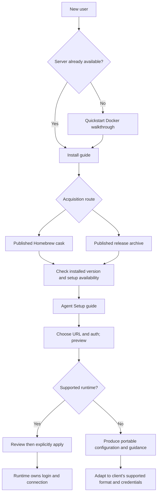

# Phase 6: Install Documentation - Research

**Researched:** 2026-09-12
**Domain:** Existing CLI installation and agent setup documentation
**Confidence:** HIGH for local contracts; MEDIUM for Homebrew documentation; installation observations pending.

<user_constraints>
## User Constraints (from CONTEXT.md)

The following decisions and discretion areas are copied verbatim from the phase context. [VERIFIED: .planning/phases/06-install-documentation/06-CONTEXT.md:23-70]

<!-- DATA_f937bd16_START -->
### Documentation structure — explicitly accepted

- **D-01:** Add a dedicated Install guide, with Homebrew first and release archives
  as the alternative.
- **D-02:** Add a dedicated Agent Setup guide covering runtime detection,
  preview → apply, all four auth modes, and unsupported-runtime configuration.
- **D-03:** Keep the Docker server walkthrough in Quickstart and add a clear path
  for users connecting to an existing server.
- **D-04:** Link the CLI and plugin guides to the new guides. Keep detailed
  installation and setup instructions in one canonical place.

### Inherited contracts — already decided in Phases 1–5

- **D-05:** Describe the real CLI: detection through runtime binaries, preview
  without mutation, explicit `--apply`, supported runtime/auth combinations,
  visible unsupported rows, idempotent reinstallation, and skill distribution.
  Use current CLI help and runtime Plans as evidence; do not infer capabilities
  from a config directory or promise unsupported Cursor integration.
- **D-06:** Carry Phase 5 D-17–D-20 forward: OAuth-client uses a required,
  non-secret `--client-id`; native credentials remain environment references;
  `--token-file` is the generic-only setup path. Preserve the distinction between
  MCP setup credentials and the separate headless Connect CLI's credentials.
- **D-07:** Preserve the standalone Claude plugin path. `/engram-setup` delegates
  when the binary is present and retains its Claude-only fallback when absent.
  Link to its canonical explanation without hand-maintaining a second argv table.
- **D-08:** Phase 1's accepted ownership boundary remains: do not add CI gates
  asserting third-party behavior or run live agent registration as a docs test.
  Phase 6's explicit four-platform installation observation is still required;
  a published cask, source inspection, or downloaded archive alone does not prove
  an actual install. Record observations with platform, version and evidence.
- **D-09:** Release-please owns SemVer tags/releases. Milestone CalVer is not a
  release version. Distinguish the currently published binary from unreleased
  local setup changes; do not describe an unavailable release as installable.

### Agent's discretion

- Exact filenames, headings, concise examples, link placement and troubleshooting
  wording within the accepted structure and existing docs-site conventions.
- Appropriate existing build/link checks and read-only command conformance
  checks. No tests that only assert prose keywords or duplicate implementation.
- How to assemble existing release/install evidence, preserving honest pending
  observations where a platform or execution environment is unavailable.

### Deferred Ideas

None — discussion stayed within the existing phase scope. Unobserved installation
requirements remain pending work, not implicitly deferred or waived.
<!-- DATA_f937bd16_END -->
</user_constraints>

## Summary

Write the two accepted guides and update the three existing entry points. Keep installation, server provisioning, MCP agent setup, and headless Connect usage visibly distinct. The existing guides already use frontmatter-first Markdown and root-relative links, and navigation autogenerates its Guides group. No framework change is needed. [VERIFIED: docs-site/src/content/docs/guides/quickstart.md:1-51; docs-site/src/content/docs/guides/cli.md:1-44; docs-site/astro.config.mjs:28-35]

The critical release boundary is stronger than a stale help example: the latest published release is **v0.15.1**, published **2026-09-09T23:22:44Z**, and its tree has no setup command. The current cask declares **0.15.1**, with all four archive targets. Local setup and delegation work is unreleased. Draft and build accurate documentation now; explicitly label setup availability until a release containing the final implementation exists. Do not mark the Homebrew requirement satisfied from publication alone. [VERIFIED: GitHub release API, 2026-09-12; GitHub tap contents API, 2026-09-12; git cat-file -e v0.15.1:cmd/engram/setup.go returned missing; git log v0.15.1..HEAD]

**Primary recommendation:** split the plan into canonical documentation and navigation work, then release-backed acceptance evidence. An outstanding observation must not stop preparing the docs, and green docs must not erase that outstanding observation. [VERIFIED: 06-CONTEXT.md D-01–D-09; .planning/ROADMAP.md:523-547]

## Architectural Responsibility Map

| Capability | Primary tier | Secondary tier | Rationale |
| --- | --- | --- | --- |
| Binary acquisition instructions | Static documentation | Existing release pipeline | Docs explain artifacts the release pipeline publishes. [VERIFIED: .goreleaser.yaml:18-44] |
| Runtime discovery, registration, skills | Local CLI | Agent runtime CLI | Setup owns plans and reports; runtime CLIs own their configuration. [VERIFIED: internal/setup/plan.go:4-16; cmd/engram/setup.go:572-609] |
| Server provisioning and authentication | Existing server/operator | Agent runtime | Preserve Docker walkthrough and link to configuration; this phase changes no auth implementation. [VERIFIED: 06-CONTEXT.md D-03,D-05,D-06] |
| Four-platform installation evidence | Release acceptance | Available test hosts | One-time observations, not new third-party CI gates. [VERIFIED: 06-CONTEXT.md D-08] |

## Project Constraints (from AGENTS.md)

- Use Context7 CLI for new library/API/CLI questions; resolve the library first, then fetch, with at most three commands per question. Never send secrets in queries. The already-fetched Homebrew documentation was reused. [VERIFIED: user-provided AGENTS.md instructions]
- Consult CodeGraph before locating code when an index exists. It was consulted; direct source reads take precedence over stale graph content. No planning graph was present. [VERIFIED: user-provided AGENTS.md instructions; codegraph explore and graph file probe, 2026-09-12]
- Follow GitHub Issues and GSD for durable tracking; Beads is retired. The discovered Beads skill does not override the explicit repository retirement. No memory writes or remote issue messages are part of this research. [VERIFIED: AGENTS.md, Issue Tracking; orchestrator task boundary]
- Keep the existing task runner, Cobra/koanf configuration conventions, and committed generated surfaces. No Viper, cocogitto, runtime implementation changes, custom install script, or new package is needed. [VERIFIED: AGENTS.md, Conventions; 06-CONTEXT.md, Phase Boundary]
- Use Conventional Commits and branch/PR workflow; never push directly to main. Release versions remain SemVer; milestone labels remain their original start-date CalVer and require marked roadmap headings. Release-please owns release mutation. [VERIFIED: AGENTS.md, Conventions]
- Preserve frontmatter as the first content in docs and other excluded Markdown; license scope belongs to the licenser configuration. Do not add SPDX headers above docs frontmatter. Lint and formatting must be clean; run the full task suite if code changes. [VERIFIED: AGENTS.md, Conventions and Session Completion]
- Preserve explicit, correctable memory behavior, authorization isolation, async summaries, and preview-only migration defaults. This documentation phase introduces no memory/auth/migration behavior or automatic capture. [VERIFIED: AGENTS.md, Memory contract and Migrations; 06-CONTEXT.md, Phase Boundary]
- Preserve generated setup references and their existing read-only lint/regenerate-diff checks. Do not hand-copy a second native-runtime argv matrix into the new guides. [VERIFIED: 06-CONTEXT.md D-07; Taskfile.yaml:89-92]

<phase_requirements>
## Phase Requirements

| ID | Description | Research support |
| --- | --- | --- |
| REQ-docs-install-path | docs-site documents how to obtain the binary, including the exact working Homebrew invocation. | Install guide, existing archive naming, publication and actual-install distinction. [VERIFIED: .planning/REQUIREMENTS.md:60] |
| REQ-docs-setup-documented | docs-site documents setup runtimes, preview/apply, and unsupported-runtime configuration. | Source-derived behavior and auth matrix below. [VERIFIED: .planning/REQUIREMENTS.md:61] |
| REQ-homebrew-cask-published | A tagged release publishes the cask; users can install on macOS/Linux and amd64/arm64. | Published artifact evidence exists; four actual-install observations remain pending. [VERIFIED: .planning/REQUIREMENTS.md:23; GitHub tap API, 2026-09-12] |
</phase_requirements>

## Standard Stack

Keep the existing documentation dependencies; do not install a new library or upgrade the stack for this phase. These are project declarations, not latest-version recommendations. [VERIFIED: docs-site/package.json:5-19]

<!-- DATA_2cd381b7_START -->
| Component | Verbatim declared value | Use |
| --- | --- | --- |
| Package manager | `"packageManager": "pnpm@11.20.0"` | Respect project package-manager selection. |
| Starlight | `"@astrojs/starlight": "^0.41.0"` | Existing Markdown documentation shell. |
| Astro | `"astro": "^7.0.0"` | Existing static build. |
| Build script | `"build": "astro build"` | Use the existing build entry point. |
<!-- DATA_2cd381b7_END -->

The docs workflow declares `node-version: "24"`, runs `pnpm install --frozen-lockfile`, then `pnpm build`; reuse those exact commands in the docs package directory when dependencies need preparing. [VERIFIED: .github/workflows/docs-site.yaml:25-41]

### Package Legitimacy Audit

Not applicable: no new dependency or package upgrade is recommended. A version inspection unexpectedly caused the installed pnpm policy to synchronize existing node_modules to the lockfile, reporting Astro 7.3.2; report this as an environment side effect, not a planned dependency change. [VERIFIED: pnpm --dir docs-site exec astro --version output, 2026-09-12]

## Architecture Patterns

### System flow



This flow implements accepted D-01–D-09; it adds no new runtime owner. [VERIFIED: 06-CONTEXT.md D-01–D-09]

### Recommended content responsibility

Proposed filenames are planning choices, not claims about existing files:

| Proposed change | Responsibility |
| --- | --- |
| New Install guide | Homebrew first; four archive names/platform mapping; version check; unsigned macOS handling; link to setup and server quickstart. |
| New Agent Setup guide | Availability notice; endpoint/auth inputs; detection; preview/apply; support matrix; result interpretation; skills; manual generic route. |
| Existing Quickstart | Keep Docker walkthrough; introduce existing-server route; route registration to Agent Setup. |
| Existing headless CLI guide | Add acquisition/setup links while retaining its separate Connect credentials and endpoint contract. |
| Existing plugin guide | Replace stale claim that slash command is the only registration path; explain delegation/fallback and link to canonical setup. Remove obsolete duplicated argv table. |

These edits implement the accepted structure. Existing frontmatter and link examples are `title: Quickstart`, `description: ...`, and `[Configure](/guides/configure/)`; sidebar source is `{ label: 'Guides', items: [{ autogenerate: { directory: 'guides' } }] }`. [VERIFIED: 06-CONTEXT.md D-01–D-04; docs-site/src/content/docs/guides/quickstart.md:1-4,37; docs-site/astro.config.mjs:33]

### Exact setup contract to document

- The registry is `[]Runtime{ClaudeCode, Codex, OpenCode, Generic}`. CLI help reports `claude-code, codex, opencode, generic`; generic is explicit opt-in. Cursor has no native registry entry; route unsupported clients to generic. Presence comes from the runtime binary on PATH. [VERIFIED: internal/setup/runtime.go:70,95-128; internal/setup/codex.go:20-26; internal/setup/generic.go:24-52; go run ./cmd/engram setup --help]
- The endpoint flag is `"url"`, described as `"MCP endpoint URL to register, used verbatim — never appended to or stripped (required) (default: ENGRAM_URL)"`. Include the deployed MCP path, not an assumed server root. [VERIFIED: cmd/engram/setup.go:625-626]
- Preview invokes read probes; Claude Code and opencode can contact the configured URL, whereas Codex reads local state. Preview means no mutation, not no network or successful connectivity. [VERIFIED: cmd/engram/setup.go:578-581; internal/setup/apply.go:191-199]
- Apply installs registration and embedded curation skills. Show both facets and all rows; OAuth login remains a subsequent runtime flow. The plugin fallback is Claude-only registration; it does not replace binary skill distribution. [VERIFIED: cmd/engram/setup.go:585-591; skill/engram/commands/engram-setup.md:79-113]
- Outcomes are exactly `"not-present"`, `"would-write"`, `"already-correct"`, `"wrote"`, `"failed"`. A missing runtime is expected; preview can render failures without a failing process result, and a zero-exit preview is not proof of registration. Generic remains `"would-write"` even under apply because it writes no runtime state. [VERIFIED: internal/setup/plan.go:34-54; cmd/engram/setup.go:396-405; internal/setup/generic.go:74-88]
- Idempotence means convergence; do not promise that a second apply issues no writes. Actions run before comparing the observed before/after state. [VERIFIED: internal/setup/apply.go:200-210]

### Source-derived auth matrix

The cells below describe authored setup support; installed runtime versions may still reject unsupported CLI flags. Present such failures honestly rather than inventing runtime compatibility. [VERIFIED: internal/setup/apply.go:202-205]

<!-- DATA_6ca927ef_START -->
| Runtime | `"oauth"` | `"oauth-client"` | `"bearer"` | `"none"` | Source |
| --- | --- | --- | --- | --- | --- |
| `"claude-code"` | Yes | Yes | Yes | Yes | [VERIFIED: internal/setup/claudecode.go:123-170] |
| `"codex"` | Yes | Yes | Yes | Yes | [VERIFIED: internal/setup/codex.go:85-117] |
| `"opencode"` | Yes | Unsupported | Yes | Yes | [VERIFIED: internal/setup/opencode.go:115-138] |
| `"generic"` | Yes | Unsupported | Yes | Yes | [VERIFIED: internal/setup/generic.go:136-159] |
<!-- DATA_6ca927ef_END -->

For OAuth-client, `--client-id` is required and non-secret; other modes reject it. Scripted Claude registration needs `MCP_CLIENT_SECRET` in its inherited environment, with no interactive stdin. Native bearer setup stores a reference to `ENGRAM_TOKEN`, not its contents; `--token-file` is ignored for native runtimes and marks `token_file=ignored`. Generic token-file output is only provenance. Never claim the generic placeholder is a universally working credential configuration. [VERIFIED: cmd/engram/setup.go:593-608,632-635; internal/setup/generic.go:99-115]

Headless Connect instead uses `--server` / `ENGRAM_SERVER_URL` and reads bearer credentials through its existing env/file precedence. Link to its guide; do not apply that behavior to MCP setup. [VERIFIED: docs-site/src/content/docs/guides/cli.md:26-44]

## Don't Hand-Roll

| Problem | Use instead | Rationale |
| --- | --- | --- |
| Native registration argv documentation | Setup help and existing generated slash-command reference | One authored command source; no second copied matrix. [VERIFIED: internal/setup/plan.go:11-16; 06-CONTEXT.md D-07] |
| Binary acquisition | Existing cask and release archives | A new install script/distribution mechanism is out of scope. [VERIFIED: 06-CONTEXT.md Phase Boundary,D-01] |
| Docs navigation/build | Existing autogeneration and workflow | No custom link framework or test harness needed. [VERIFIED: docs-site/astro.config.mjs:28-35; .github/workflows/docs-site.yaml:25-41] |
| Third-party verification | One-time installation observation records | No new CI tests of Homebrew, Gatekeeper, or live agent registration. [VERIFIED: 06-CONTEXT.md D-08; 01-CONTEXT.md D-11] |

## Release Evidence and Remaining Observations

The release API lists `"checksums.txt"` and `"engram_0.15.1_darwin_amd64.tar.gz"`, `"engram_0.15.1_darwin_arm64.tar.gz"`, `"engram_0.15.1_linux_amd64.tar.gz"`, `"engram_0.15.1_linux_arm64.tar.gz"`. The naming template is `"{{ .ProjectName }}_{{ .Version }}_{{ .Os }}_{{ .Arch }}"`, format `tar.gz`; `darwin` means the macOS build in this release configuration. Offer checksum verification and extraction, then installation of the executable onto a user-chosen PATH directory. Do not introduce an automatic installer script. [VERIFIED: GitHub release API, 2026-09-12; .goreleaser.yaml:24-44]

The tap commit introducing the cask is `6db11657e8327ff498b48e2a9fe046f64018c8b1`, dated `2026-09-09T23:25:56Z`, declaring `version "0.15.1"`. The cask removes macOS quarantine before invoking the installed executable, checks its JSON version, and generates bash/zsh/fish completions. Archive users do not receive cask hooks automatically; explain unsigned-macOS handling specifically, never a global Gatekeeper disable. [VERIFIED: GitHub tap commit/content APIs, 2026-09-12; .goreleaser.yaml:148-199]

Homebrew supports explicit cask selection and portable OS/architecture branches. Use the existing fully-qualified invocation `brew install seanb4t/tap/engram`; adding `--cask` is an explicit selector supported by official docs. Its exact installed behavior remains an acceptance observation. [VERIFIED: skill/engram/commands/engram-setup.md:103; CITED: https://github.com/Homebrew/brew/blob/main/Library/Homebrew/cmd/install.rb; CITED: https://github.com/Homebrew/brew/blob/main/docs/Cask-Cookbook.md]

| Target | Publication | Actual install observed in this research | Remaining evidence |
| --- | --- | --- | --- |
| macOS amd64 | Archive and cask branch present | No | Native Intel host or explicitly documented Intel/Rosetta environment. |
| macOS arm64 | Archive and cask branch present | No | Current host can be a candidate once installation is authorized. |
| Linux amd64 | Archive and cask branch present | No | Suitable Linux host or isolated amd64 container with Homebrew. |
| Linux arm64 | Archive and cask branch present | No | Suitable Linux host or isolated arm64 container with Homebrew. |

Publication cells are API-verified; no install was run on any target. Candidate environments above are proposed observation mechanisms, not verified availability or claims of native-platform equivalence. [VERIFIED: GitHub release/tap APIs and research actions, 2026-09-12]

For each observation, record OS/version, architecture and native/emulated execution, Homebrew version/prefix, release tag, cask/tap revision, exact install command and exit result, resolved executable, its JSON version, and completion results. An archive download or version run from an extracted archive cannot close the cask installation row. A temporary prefix/container avoids changing the user's active install; do not silently claim an emulated observation proves native hardware behavior. Prefer clean disposable hosts and the same documented invocation. [VERIFIED: 06-CONTEXT.md D-08; .goreleaser.yaml:160-199]

Issue #514 supplies the release handoff. Refresh its body and comments together: older comments contain superseded credential diagnoses. Phase 6 still needs release-run evidence that upload was not skipped, the tap/release identity, and all four installation observations. Retain the separate go-install check and recovery concerns under their own ownership; do not conflate them with docs acceptance or force a tag/release. [VERIFIED: https://github.com/seanb4t/engram/issues/514, saved API response read 2026-09-12; 06-CONTEXT.md D-08,D-09]

## Common Pitfalls

1. **Promising setup from the current cask.** v0.15.1 lacks the command. Keep explicit unreleased availability wording until a qualifying release is observed; then refresh the examples and evidence against that release. [VERIFIED: git cat-file check and release API, 2026-09-12]
2. **Keeping contradictory old plugin prose.** The existing guide says slash setup is the only registration path and duplicates a bearer-token argv table. Replace that explanation with delegation/fallback and canonical links; keep hook documentation. [VERIFIED: docs-site/src/content/docs/guides/plugin.md:12,26-60; skill/engram/commands/engram-setup.md:37-48,79-113]
3. **Calling preview a connectivity test.** Preview reports reads without guaranteeing success; inspect each row and avoid synthetic endpoints on real native runtimes. [VERIFIED: internal/setup/apply.go:191-199; 06-CONTEXT.md D-08]
4. **Treating portable output as automatic setup.** Generic has no filesystem destination or registration action. Its config field is a JSON string even in JSON output; adapt credential placeholders to the destination client's documented configuration. [VERIFIED: cmd/engram/setup.go:206-222; internal/setup/generic.go:74-115,117-134]
5. **Confusing skills with plugin hooks.** Binary setup installs curation skills; the standalone plugin has its own hooks and Claude-only fallback. Explain the two paths without claiming binary setup installs plugin hooks. [VERIFIED: cmd/engram/setup.go:585-591; docs-site/src/content/docs/guides/plugin.md:6-10; skill/engram/commands/engram-setup.md:103]

## Code Examples

Use these source-authored preview templates as documentation examples, never as permission to execute setup against an actual runtime. The following four commands are quoted verbatim from the generated reference. [VERIFIED: skill/engram/commands/engram-setup.md:63-66]

<!-- DATA_174db5ac_START -->
```sh
engram setup --url https://engram.example.com/mcp --auth oauth
engram setup --url https://engram.example.com/mcp --auth oauth-client --client-id example-client-id
engram setup --url https://engram.example.com/mcp --auth bearer
engram setup --url https://engram.example.com/mcp --auth none
```
<!-- DATA_174db5ac_END -->

Explain replacing the sample endpoint, reviewing every row, and appending `--apply` to the same chosen invocation only after reviewing its intended changes. Show an explicitly selected native runtime and the opt-in generic route using the actual flag definitions above. Do not duplicate native registration argv. [VERIFIED: skill/engram/commands/engram-setup.md:81-99; cmd/engram/setup.go:629-636]

## State of the Art

The relevant transition is repository-specific: published binary acquisition exists, while multi-runtime setup and generated delegation are present locally after v0.15.1. Existing Docker-only onboarding and plugin-only registration prose must be reconciled with that release boundary. No ecosystem migration or package refresh belongs in this phase. [VERIFIED: release API and git log comparison, 2026-09-12; 06-CONTEXT.md Phase Boundary]

## Assumptions Log

No unverified technical claim is used as a locked decision. Disposable Linux containers, alternate macOS prefixes, and Rosetta are only candidate observation mechanisms; execution must first establish the available environment and record what was actually observed. No native-platform equivalence or successful install is assumed. [VERIFIED: orchestrator research boundary; 06-CONTEXT.md D-08]

## Open Questions

1. Which release first includes final setup/delegation? Current evidence only establishes that v0.15.1 does not. Keep the availability note and release acceptance checkpoint explicit. [VERIFIED: git tag tree check, 2026-09-12]
2. Which environments can supply the three non-native target observations? This session established only the local Darwin arm64 host, not remote Intel Macs or Linux test hosts. This is an execution access gap, not a blocker to writing/building docs. [VERIFIED: uname -sm, 2026-09-12]
3. Does the observed publishing run satisfy every #514 checklist detail? The cask exists, but its existence alone does not replace reading the publishing-run upload guard and log. Plan that read-only evidence collection before sealing the requirement. [VERIFIED: issue #514 checklist B; tap content API]

## Environment Availability

| Dependency | Observed availability | Role / fallback |
| --- | --- | --- |
| Go | 1.27.1 darwin/arm64 | Local help conformance worked. |
| Task | 3.53.1 | Existing lint/generated-surface checks. |
| Node | v26.8.2 | Local runtime; CI pins Node 24. |
| pnpm | Global 12.4.1; project execution selected 11.20.0 | Respect project pin. |
| Astro/dependencies | Astro 7.3.2 after automatic lockfile synchronization | Existing docs build environment available. |
| rumdl | 0.2.73 | Existing Markdown lint. |
| Homebrew | 6.0.22-316-g3652033 | Available on Darwin arm64; no cask install observed. |
| GitHub CLI | Available; release/tap APIs read successfully | Read-only publication evidence. |
| Other three platform environments | Not established | Record access gap; use separately authorized disposable hosts. |

All observations came from command/version probes on 2026-09-12. The unexpected pnpm node_modules synchronization was reported to the orchestrator. No runtime registration, cask installation, release mutation, or remote message was performed. [VERIFIED: command outputs and research actions, 2026-09-12]

## Validation Architecture

Nyquist validation is enabled; use existing build, lint, and source-derived behavior checks, not prose-keyword tests. [VERIFIED: .planning/config.json, workflow.nyquist_validation; 06-CONTEXT.md Agent's discretion]

### Test Framework

| Property | Value |
| --- | --- |
| Docs build | Existing `"build": "astro build"`. [VERIFIED: docs-site/package.json:9] |
| Markdown check | Existing `rumdl check .`. [VERIFIED: Taskfile.yaml:103-105] |
| Setup drift check | Existing `go run ./internal/surfacesgen --check-setup`. [VERIFIED: Taskfile.yaml:89-92] |
| Quick task validation | Targeted rumdl on edited pages; inspect changed links and headings. |
| Phase docs gate | Run docs package build, Markdown lint, setup drift check; inspect generated pages and internal links. |
| If code changes | Full `task` per repository instruction; investigate why code entered a documentation-only phase. |

### Phase Requirements → Test Map

| Requirement | Behavior | Type | Existing command / observation | Gap |
| --- | --- | --- | --- | --- |
| REQ-docs-install-path | Canonical acquisition route and valid links | Build + manual content review | `pnpm build` within docs package; targeted Markdown lint | New guide and rendered link inspection |
| REQ-docs-setup-documented | Real setup behavior, auth support and manual route | Read-only help/source conformance + docs build | `go run ./cmd/engram setup --help`; existing setup drift check | New guide; compare examples to help/reference, no live registration |
| REQ-homebrew-cask-published | Real published cask installs on four targets | Manual release acceptance | Read-only GitHub evidence plus actual isolated installs later | All four install observations remain pending |

The build/help/drift commands are existing source-declared commands or were run read-only here; no guarantee is made that a cold build completes within thirty seconds. [VERIFIED: Taskfile.yaml:89-105; docs-site/package.json:9; go run help output]

### Sampling and Wave 0

Per docs task, lint changed pages and review affected links. At the documentation wave boundary, build once and inspect both new routes plus all incoming navigation links. At phase acceptance, keep release/install observations separate from the green local checks. No test framework installation or new automated test files are necessary for reversible prose edits. [VERIFIED: 06-CONTEXT.md D-08 and Agent's discretion]

## Security Domain

Security enforcement is not explicitly disabled. This phase changes documentation, not authentication/session implementations; review examples against existing credential and mutation contracts. [VERIFIED: .planning/config.json; 06-CONTEXT.md Phase Boundary,D-06,D-08]

| Control area | Applicability | Documentation control |
| --- | --- | --- |
| Authentication | Applies to examples | Explain runtime OAuth, non-secret client ID, inherited secret environment and native bearer reference. |
| Session management | No implementation change | Runtime owns login/callback; do not imply setup completes OAuth. |
| Access control | No implementation change | Keep server/client distinction; no auth bypass or issuer change. |
| Input validation | Applies to examples | Complete endpoint, supported runtime/mode pairs, safely quoted user input. |
| Cryptography | No new crypto | Existing artifact checksums and scoped unsigned-macOS explanation; no global Gatekeeper disable. |

These are control-domain names, not claimed ASVS version-specific requirement identifiers. The generic V-number template is not asserted as the current ASVS taxonomy; no new normative compliance requirement is introduced by this docs phase. Controls derive from the current setup and release implementation. [VERIFIED: cmd/engram/setup.go:593-635; skill/engram/commands/engram-setup.md:37-56,81-99; .goreleaser.yaml:148-175]

Threats to check in review: disclosure from copying literal credentials, accidental registration through executing sample apply commands, and misrepresenting preview/portable output as successful connection. Mitigate by preserving environment references, preview/review/apply sequencing, and explicit result/availability wording. [VERIFIED: 06-CONTEXT.md D-05–D-09; skill/engram/commands/engram-setup.md:37-56,81-99]

## Sources

- Local source files and line ranges cited inline were opened during this research; help was also executed without invoking setup. HIGH confidence for current local behavior.
- [Published release](https://github.com/seanb4t/engram/releases/tag/v0.15.1), [published cask](https://github.com/seanb4t/homebrew-tap/blob/6db11657e8327ff498b48e2a9fe046f64018c8b1/Casks/engram.rb), and [issue #514](https://github.com/seanb4t/engram/issues/514) were read through GitHub APIs, with publication cross-checked against the local tag tree.
- [Homebrew install source](https://github.com/Homebrew/brew/blob/main/Library/Homebrew/cmd/install.rb) and [Cask Cookbook](https://github.com/Homebrew/brew/blob/main/docs/Cask-Cookbook.md) were retrieved by the orchestrator through Context7 `/homebrew/brew` and read from the saved outputs. MEDIUM confidence from the classify-confidence seam, even with its verified flag.
- The research-plan seam selected Context7 for the Homebrew question; the existing session fetch was reused and its digest cached under `44610a897c219e1e25816f94f0198981e8e07fdd12d8cfc46ef1a8068f5a9a55`. No additional Homebrew query exceeded the earlier three-command budget.

## Metadata

**Confidence breakdown:** Local stack/contracts HIGH; architecture HIGH (accepted scope and source); external Homebrew syntax MEDIUM (Context7 classifier); actual installation unobserved.

**Research date:** 2026-09-12. Refresh release/tap identity immediately before publishing docs or recording acceptance. This file is a planning input, not a phase verification report.
